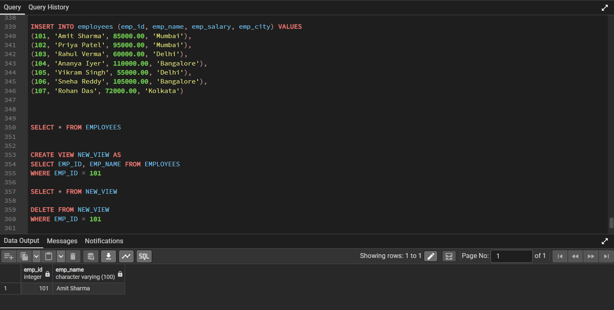
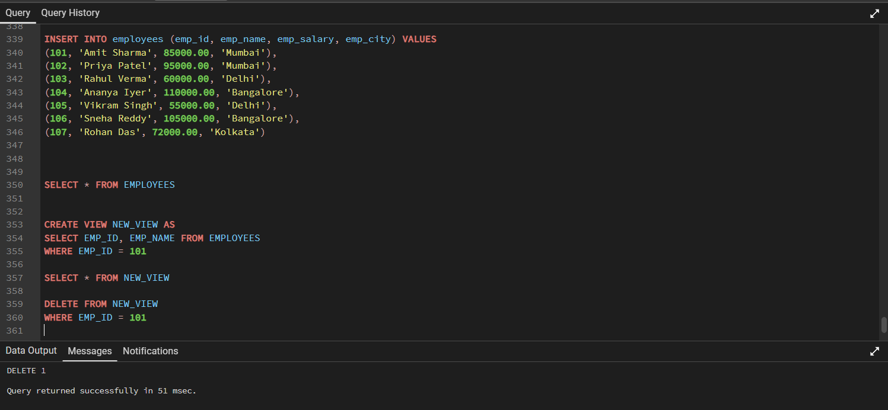
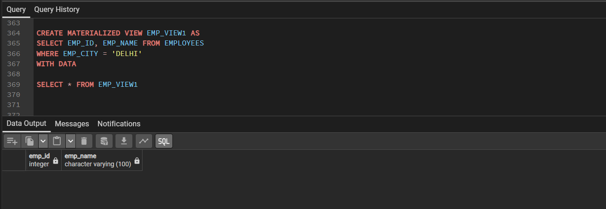
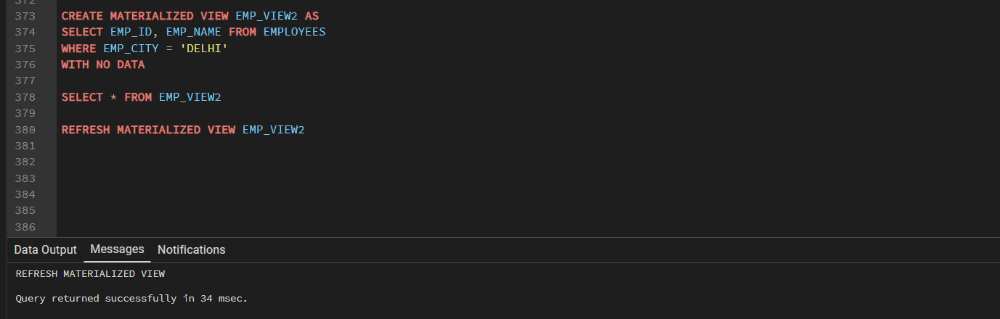

# Experiment 6: Views and Materialized Views

[svg](https://github.com/harsimran151/24BCS10151_HARSIMRAN-SINGH_-DBMS/blob/main/EXPERIMENTS/EXPERIMENT%206/README.MD#experiment-6-views-and-materialized-views)

## Objective

[svg](https://github.com/harsimran151/24BCS10151_HARSIMRAN-SINGH_-DBMS/blob/main/EXPERIMENTS/EXPERIMENT%206/README.MD#objective)

To understand and implement SQL views and materialized views in
PostgreSQL, including creating views, retrieving data from views,
deleting records through an updatable view, creating materialized views
with and without initial data, and refreshing materialized views.

------------------------------------------------------------------------

## Programs

[svg](https://github.com/harsimran151/24BCS10151_HARSIMRAN-SINGH_-DBMS/blob/main/EXPERIMENTS/EXPERIMENT%206/README.MD#programs)

### 6.1 Create, Retrieve, and Delete Data Using a View

[svg](https://github.com/harsimran151/24BCS10151_HARSIMRAN-SINGH_-DBMS/blob/main/EXPERIMENTS/EXPERIMENT%206/README.MD#61-create-retrieve-and-delete-data-using-a-view)

**Aim:** Create a view containing selected employee details, retrieve
records from the view, and delete a record through the view.

The `EMPLOYEES` table contains employee information such as employee ID,
employee name, salary, and city.

``` sql
INSERT INTO employees (emp_id, emp_name, emp_salary, emp_city) VALUES
(101, 'Amit Sharma', 85000.00, 'Mumbai'),
(102, 'Priya Patel', 95000.00, 'Mumbai'),
(103, 'Rahul Verma', 60000.00, 'Delhi'),
(104, 'Ananya Iyer', 110000.00, 'Bangalore'),
(105, 'Vikram Singh', 55000.00, 'Delhi'),
(106, 'Sneha Reddy', 105000.00, 'Bangalore'),
(107, 'Rohan Das', 72000.00, 'Kolkata');

SELECT * FROM EMPLOYEES;

CREATE VIEW NEW_VIEW AS
SELECT EMP_ID, EMP_NAME FROM EMPLOYEES
WHERE EMP_ID = 101;

SELECT * FROM NEW_VIEW;

DELETE FROM NEW_VIEW
WHERE EMP_ID = 101;
```

**Output:**

The view initially returns the employee with `EMP_ID = 101`:

``` text
emp_id    emp_name
101       Amit Sharma
```

The `DELETE` operation is successfully executed through the view, as
shown by the message:

``` text
DELETE 1
Query returned successfully
```

**Screenshot:**





The query demonstrates that a simple PostgreSQL view can be updatable.
Since `NEW_VIEW` is based directly on the `EMPLOYEES` table, deleting a
row from the view also deletes the corresponding row from the underlying
table.

------------------------------------------------------------------------

### 6.2 Create and Refresh a Materialized View

[svg](https://github.com/harsimran151/24BCS10151_HARSIMRAN-SINGH_-DBMS/blob/main/EXPERIMENTS/EXPERIMENT%206/README.MD#62-create-and-refresh-a-materialized-view)

**Aim:** Create materialized views with and without initial data and
refresh a materialized view to update its stored results.

#### 6.2.1 Materialized View With Data

A materialized view stores the result of its query physically. Using
`WITH DATA` creates the materialized view and immediately populates it
with the query result.

``` sql
CREATE MATERIALIZED VIEW EMP_VIEW1 AS
SELECT EMP_ID, EMP_NAME FROM EMPLOYEES
WHERE EMP_CITY = 'DELHI'
WITH DATA;

SELECT * FROM EMP_VIEW1;
```

**Output:**

The materialized view contains the selected columns `EMP_ID` and
`EMP_NAME` for employees whose city is Delhi. The result displayed in
the provided execution screenshot currently shows the column headers
without any rows.

**Screenshot:**



------------------------------------------------------------------------

#### 6.2.2 Materialized View Without Data

A materialized view can also be created using `WITH NO DATA`. In this
case, the view structure is created, but its query result is not
populated until a refresh is performed.

``` sql
CREATE MATERIALIZED VIEW EMP_VIEW2 AS
SELECT EMP_ID, EMP_NAME FROM EMPLOYEES
WHERE EMP_CITY = 'DELHI'
WITH NO DATA;

SELECT * FROM EMP_VIEW2;
```

**Screenshot:**



------------------------------------------------------------------------

#### 6.2.3 Refresh Materialized View

The `REFRESH MATERIALIZED VIEW` command executes the materialized view's
query again and stores the latest result.

``` sql
REFRESH MATERIALIZED VIEW EMP_VIEW2;
```

**Output:**

``` text
REFRESH MATERIALIZED VIEW

Query returned successfully in 34 msec.
```

The refresh operation successfully updates the stored data of
`EMP_VIEW2`.

**Screenshot:**


A materialized view differs from a normal view because its result is
stored physically. Therefore, when the underlying table changes, the
materialized view does not automatically reflect those changes; it must
be refreshed.

------------------------------------------------------------------------

## Learning Outcomes

[svg](https://github.com/harsimran151/24BCS10151_HARSIMRAN-SINGH_-DBMS/blob/main/EXPERIMENTS/EXPERIMENT%206/README.MD#learning-outcomes)

-   Understood the concept and purpose of SQL views.
-   Learned how to create a view using `CREATE VIEW`.
-   Learned how to retrieve data using `SELECT` from a view.
-   Implemented deletion of a record through an updatable view.
-   Understood the relationship between a view and its underlying table.
-   Learned how to create materialized views using
    `CREATE MATERIALIZED VIEW`.
-   Understood the difference between `WITH DATA` and `WITH NO DATA`.
-   Learned how to refresh a materialized view using
    `REFRESH MATERIALIZED VIEW`.
-   Understood that materialized views store query results and require
    refreshing to reflect changes in the underlying table.

------------------------------------------------------------------------

## Conclusion

[svg](https://github.com/harsimran151/24BCS10151_HARSIMRAN-SINGH_-DBMS/blob/main/EXPERIMENTS/EXPERIMENT%206/README.MD#conclusion)

This experiment provided practical knowledge of views and materialized
views in PostgreSQL. The programs demonstrated how to create and query a
normal view, perform a delete operation through an updatable view,
create materialized views with and without initial data, and refresh a
materialized view. These concepts are useful for simplifying complex
queries, controlling data access, and improving query performance by
storing frequently used query results.
